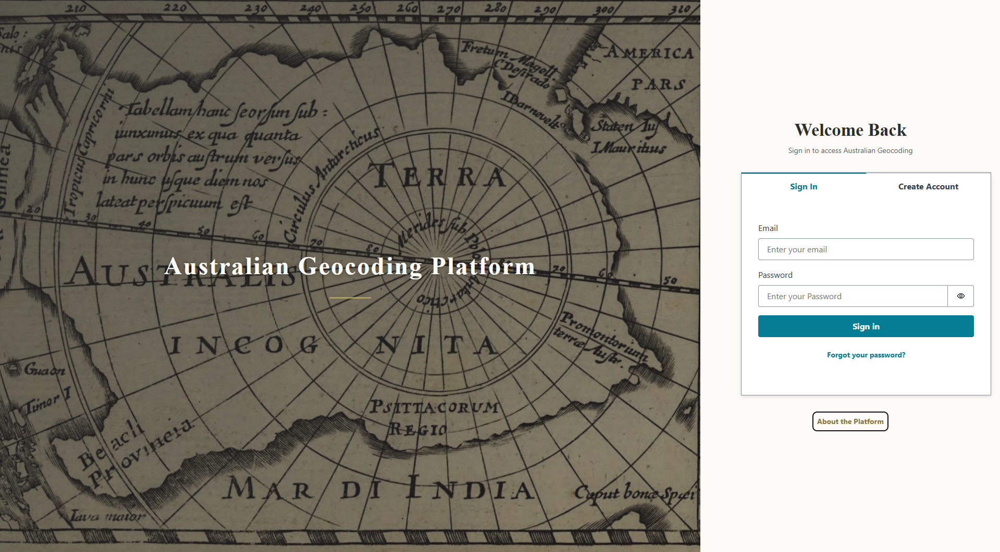
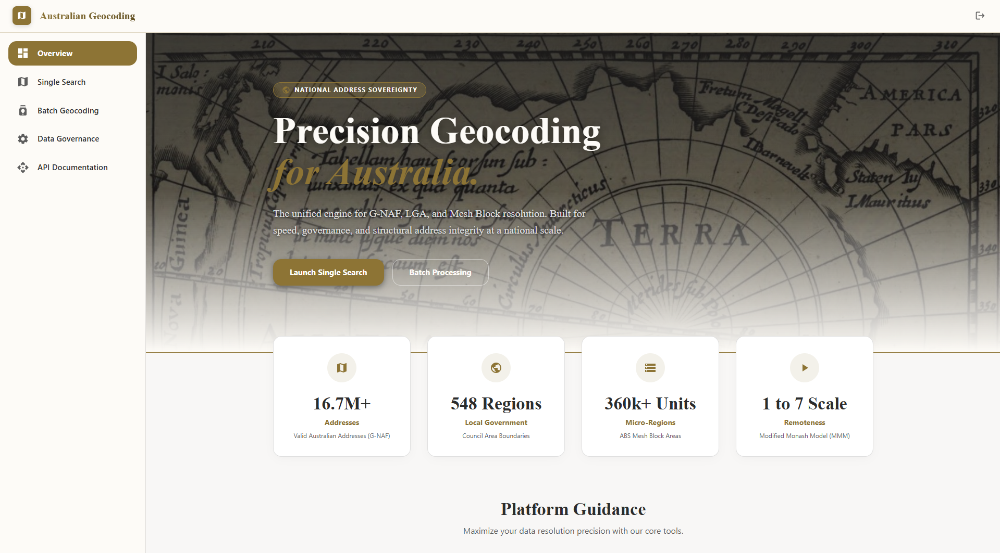
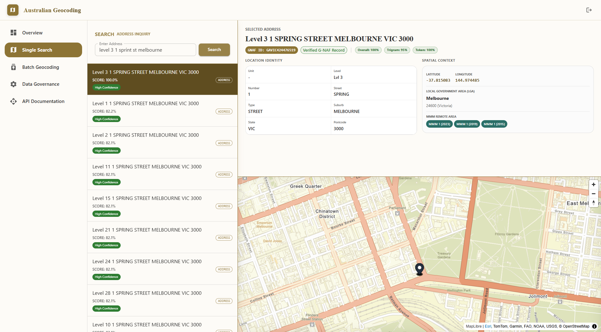
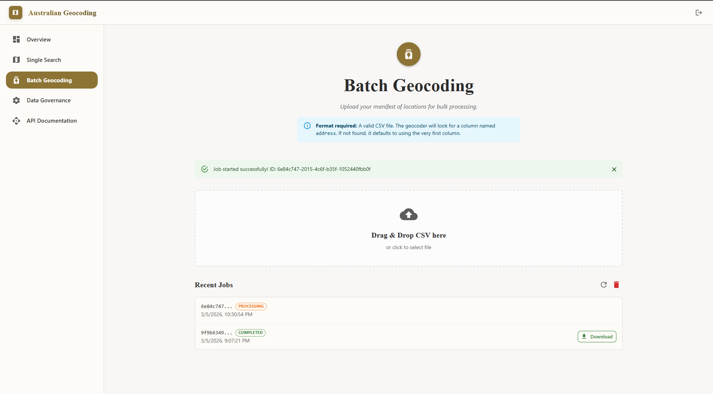
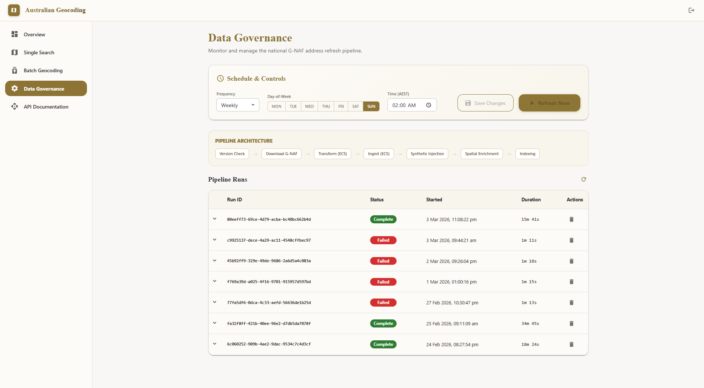
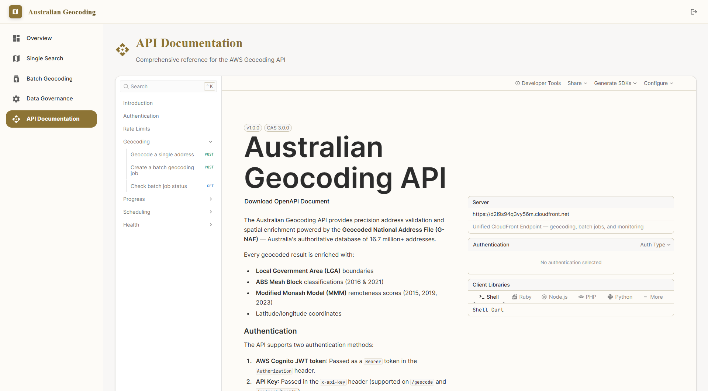
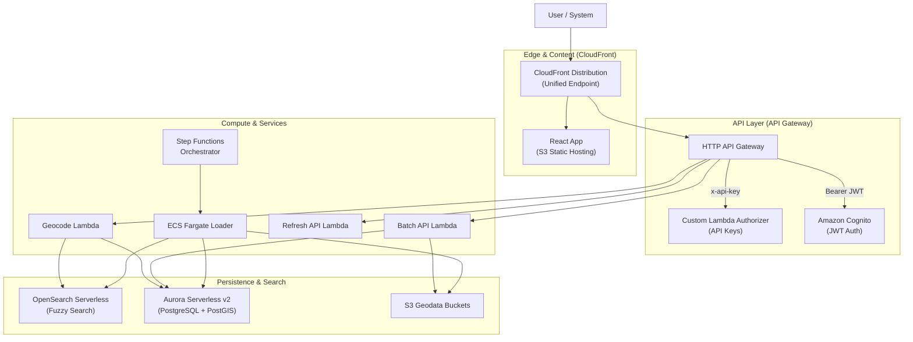

<p align="center">
  
</p>

<h1 align="center">AU Geocoding System</h1>

<p align="center">
  <strong>Enterprise-grade Australian address geocoding powered by G-NAF, AWS serverless, and PostGIS</strong>
</p>

<p align="center">
  <a href="#architecture">Architecture</a> •
  <a href="#application-screens">Screenshots</a> •
  <a href="#getting-started">Getting Started</a> •
  <a href="#deployment">Deployment</a> •
  <a href="#api-reference">API Reference</a> •
  <a href="#authentication">Authentication</a>
</p>

---

<!-- 
  📸 SCREENSHOTS: Drop your app screenshots into the screenshots/ directory.
  Recommended filenames:
    screenshots/login.png
    screenshots/search.png
    screenshots/batch.png
    screenshots/data-refresh.png
    screenshots/api-docs.png
    screenshots/overview.png
  Then uncomment the gallery below.
-->

<p align="center">
  <a href="screenshots/login.png"></a>
  <a href="screenshots/overview.png"></a>
  <a href="screenshots/search.png"></a>
</p>
<p align="center">
  <a href="screenshots/batch.png"></a>
  <a href="screenshots/data-refresh.png"></a>
  <a href="screenshots/api-docs.png"></a>
</p>

## Overview

The **AU Geocoding System** is a full-stack, serverless application that converts free-text Australian addresses into structured geocoded results using the official [G-NAF](https://geoscape.com.au/data/g-naf/) (Geocoded National Address File) dataset — the authoritative Australian government address database containing **15+ million** address records.

### Why This Exists

- **Data Sovereignty**: All processing stays within AWS `ap-southeast-2` (Sydney) — no third-party geocoding APIs.
- **Government-Ready**: Built for organisations that require controlled access, audit trails, and ISM-aligned security.
- **Automated Pipeline**: G-NAF data is ingested, transformed, spatially enriched, and indexed automatically via a Step Functions orchestrator — no manual ETL.

### Key Features

| Feature | Description |
|---------|-------------|
| **Single Address Search** | Real-time fuzzy geocoding with confidence scoring, map visualisation, and detailed result panels |
| **Batch Geocoding** | Upload CSV files for bulk address processing via S3 + Lambda |
| **Data Refresh Pipeline** | Automated Step Functions orchestrator to ingest new G-NAF releases |
| **Spatial Enrichment** | Every address is enriched with LGA, Mesh Block, SA1–SA4, and MMM (Modified Monash Model) classifications |
| **Interactive Map** | MapLibre GL map with marker placement and fly-to animations |
| **API Documentation** | Built-in interactive API docs page (Swagger/OpenAPI) |
| **API Key Access** | Programmatic access via API keys for system-to-system integrations |

### Tech Stack

| Layer | Technology |
|-------|-----------|
| **Frontend** | React 18, TypeScript, Vite, MapLibre GL JS, AWS Amplify |
| **API** | API Gateway (REST + HTTP), Lambda (Python 3.12) |
| **Search** | Amazon OpenSearch Serverless |
| **Database** | Aurora Serverless v2 (PostgreSQL 15) + PostGIS + pg_trgm |
| **Pipeline** | Step Functions, ECS Fargate, S3, Lambda |
| **Auth** | Cognito User Pool + Identity Pool (JWT + API Key) |
| **IaC** | Terraform |
| **Monitoring** | CloudWatch Alarms, Dashboard, SNS Alerts |

---

## Architecture



6. **Geocode Lambda** serves real-time queries against OpenSearch + Aurora

### Architectural Modes & Cost Optimization

This system supports three architectural modes via simple Terraform variables (`use_vpc` and `multi_az`), allowing you to balance cost, security, and high availability.

| Feature | Zero-VPC (`use_vpc=false`) | Single-AZ VPC (`use_vpc=true`, `multi_az=false`) | Multi-AZ VPC (`use_vpc=true`, `multi_az=true`) |
| :--- | :--- | :--- | :--- |
| **Common Use Case** | POC / Local Dev | Dev / Test (Org Policy Compliant) | Production (High Availability) |
| **Connectivity Cost** | **$0 / month** | **~$24 / month** (Single AZ Endpoints) | **~$72+ / month** (Multi-AZ Endpoints) |
| **Security Model** | **Identity-Based** (SigV4, Public Endpoints) | **Network-Based** (Private Subnets, PrivateLink) | **Network-Based** (Private Subnets, PrivateLink) |
| **Public Internet** | Resources can reach public internet. | **NO public internet access.** | **NO public internet access.** |
| **Performance** | **Moderate**: Data API overhead. | **High**: Direct TCP connections/COPY. | **High**: Direct TCP connections/COPY. |
| **High Availability** | N/A (Serverless routing) | Low (Dependencies tied to one AZ) | **High** (Endpoints across 3 AZs) |

> [!TIP]
> **Switching Modes:** To change the architecture, simply set the variables in a `.tfvars` file or via the CLI:
> `terraform apply -var="use_vpc=true" -var="multi_az=false"`

#### How Zero-VPC Works (Default)
- **Database Access**: Uses the **Aurora Data API** (`boto3.client('rds-data')`) over HTTPS instead of traditional direct TCP connections.
- **OpenSearch**: Configured with a **Public Endpoint**, but strictly secured via **IAM Access Policies (AWS SigV4)**.
- **Networking**: Lambdas and ECS tasks run in public subnets or non-VPC mode, allowing them to reach AWS public APIs for free without NAT Gateways or VPC Endpoints.

#### How VPC-Isolated Works
When `use_vpc=true` is set, the system pivots from identity-based security to network-based security:
- **Compute Placement**: Lambdas and ECS Tasks move from the public internet into **Private Subnets**.
- **Data Path**: The system bypasses the Aurora Data API, connecting directly to the database via `psycopg2` for significant performance gains in bulk operations.
- **PrivateLink**: Traffic to AWS services (S3, ECR, DynamoDB, Logs) stays on the AWS private backbone via **VPC Interface Endpoints**.
- **Hybrid Internet Access**: Data discovery Lambdas (`check_version`, `downloader`) remain outside the VPC to maintain access to government APIs (data.gov.au) without the cost of a NAT Gateway, while sensitive processing remains isolated.

##### 🟢 Single-AZ VPC (`multi_az=false`) - *The Cost-Effective Middle Ground*
This mode provides a highly secure, network-isolated environment at a fraction of the cost of a full HA deployment.
- **Pros**: Full compliance with organization policies prohibiting public internet access. drastically reduced latency for DB queries.
- **Cons**: If the specific Availability Zone (e.g., `ap-southeast-2a`) experiences a rare service outage, the processing pipeline and search API may be temporarily unavailable.

##### 🔵 Multi-AZ VPC (`multi_az=true`) - *Production High Availability*
Enabling `multi_az` replicates the networking infrastructure across multiple availability zones.
- **Improved Resilience**: VPC Endpoints are provisioned in all active subnets. If one AZ fails, traffic automatically routes to the healthy AZ.
- **Database HA**: Aurora Serverless v2 will maintain a standby in a different AZ, ensuring near-instant failover.
- **Scalability**: ECS Fargate tasks are distributed across zones, preventing a single hardware failure from impacting national data ingestion.

---

## Application Screens

### 1. Login
Secure authentication via AWS Cognito with a custom UI featuring the historic *Terra Australis* map. Supports email/password login with optional TOTP MFA. Self-registration is disabled — users are provisioned by administrators via the CLI.

### 2. Address Search
The primary interface. Enter any Australian address in the search bar for real-time fuzzy geocoding. Results appear with confidence scores, and clicking a result shows a detail panel with the full G-NAF record, spatial enrichment data (LGA, SA1–SA4, Mesh Block, MMM), and an interactive MapLibre GL map with marker placement.

### 3. Batch Geocoding
Upload a CSV file containing addresses for bulk processing. The system processes them asynchronously via S3 + Lambda. The page explains the expected CSV format and shows job status with download links for results.

### 4. Data Refresh
Administrative dashboard for managing the G-NAF data pipeline. Shows current data version, pipeline execution status, and provides controls to trigger a new ingestion run via the Step Functions orchestrator.

### 5. API Documentation
Built-in interactive API documentation rendered from the OpenAPI spec (`openapi.yaml`). Shows all available endpoints, request/response schemas, and allows testing directly from the browser.

### 6. Overview / Home
Landing page summarising system health metrics, data statistics, and quick links to all features.

---

## Project Structure

```
AWSGeocoding/
├── backend/
│   ├── database/
│   │   └── schema.sql                  # PostgreSQL + PostGIS schema
│   ├── docker/
│   │   └── loader/                     # ECS Fargate loader container
│   │       ├── Dockerfile
│   │       ├── entrypoint.py
│   │       └── requirements.txt
│   ├── lambdas/
│   │   ├── api_key_authorizer/         # API Key validation (API Gateway authorizer)
│   │   ├── batch_api/                  # API for submitting/monitoring batch jobs
│   │   ├── batch_processor/            # CSV batch geocoding logic
│   │   ├── check_version/              # G-NAF version checker
│   │   ├── geocode/                    # Real-time geocoding endpoint
│   │   ├── loader/                     # Data ingestion, spatial enrichment, indexing
│   │   │   ├── index.py                # Step Functions handler
│   │   │   ├── ingest.py               # PostgreSQL ingestion logic
│   │   │   ├── indexer.py              # OpenSearch indexing
│   │   │   ├── spatial_reference.py    # LGA/SA/MeshBlock enrichment
│   │   │   ├── synthetic.py            # Virtual parent record generation
│   │   │   └── transform.py            # G-NAF CSV transformer
│   │   ├── update_progress/            # Pipeline progress tracker
│   │   └── validator/                  # Post-ingestion data validator
│   └── sql/
│       └── views.sql                   # Database views
├── frontend/
│   ├── public/
│   │   ├── openapi.yaml                # API spec for in-app docs
│   │   └── assets/                     # Static assets
│   ├── src/
│   │   ├── components/                 # React components
│   │   │   ├── Batch/                  # Batch geocoding UI
│   │   │   ├── CustomAuthenticator.tsx  # Login UI
│   │   │   ├── GeocodeMap.jsx          # MapLibre GL map
│   │   │   └── ...
│   │   ├── pages/                      # Page-level components
│   │   │   ├── SearchPage.tsx
│   │   │   ├── BatchGeocodingPage.tsx
│   │   │   ├── DataRefreshPage.tsx
│   │   │   ├── APIsPage.tsx
│   │   │   └── OverviewPage.tsx
│   │   ├── amplifyconfiguration.json   # Amplify/Cognito config (templated)
│   │   └── App.tsx                     # App routes and layout
│   ├── package.json
│   └── vite.config.ts
├── terraform/
│   ├── main.tf                         # Provider config
│   ├── variables.tf                    # Input variables
│   ├── auth.tf                         # Cognito (User Pool, IdP, Identity Pool)
│   ├── api.tf                          # API Gateway (REST + HTTP)
│   ├── database.tf                     # Aurora Serverless v2
│   ├── opensearch.tf                   # OpenSearch Serverless
│   ├── ecs.tf                          # ECS Fargate (loader)
│   ├── lambda.tf                       # Lambda functions
│   ├── pipeline.tf                     # Step Functions orchestrator
│   ├── monitoring.tf                   # CloudWatch Alarms + SNS
│   ├── dashboard.tf                    # CloudWatch Dashboard
│   ├── storage.tf                      # S3 buckets
│   ├── maps.tf                         # Amazon Location Service
│   ├── outputs.tf                      # Terraform outputs
│   └── bootstrap/                      # Initial state backend setup
### Operational Scripts

The `scripts/` directory contains tools for managing the lifecycle of the system.

| Category | Script | Description |
|---|---|---|
| **Build & Deploy** | `apply_migration.py` | Applies SQL schema changes to Aurora RDS |
| | `build_loader.bat` | Builds and pushes the ECS Fargate loader image |
| | `deploy_frontend.bat` | Builds and deploys React app to S3/CloudFront |
| | `deploy_infra.bat` | Wrapper for `terraform apply` with environment checks |
| | `generate_config.js` | Updates `amplifyconfiguration.json` from TF outputs |
| **Data Ops** | `ingest_spatial.py` | Ingests LGA and Mesh Block boundaries into PostGIS |
| | `ingest_mmm_longitudinal.py` | Ingests Monash Model (MMM) remoteness data |
| | `apply_subdivide_reference.py` | Optimises geometry lookups via subdivision |
| | `index_gnaf_opensearch.py` | Manual bulk indexing script for OpenSearch |
| **Maintenance** | `manage_api_keys.py` | CLI for creating and revoking system API keys |
| | `create_test_user.sh` | Provisions Cognito users and marks them as verified |
| | `cleanup_pipeline_progress.py` | Resets Step Functions status tracking in DynamoDB |
| | `recreate_view.py` | Refreshes the `gnaf_all` database view |
| **Verification** | `verify_ingestion.bat` | Performs counts and integrity checks across DBs |
| | `test_rds_connectivity.sh` | Diagnostics for VPC peering and DB access |
| | `verify_100_percent_load.py` | Validation script for a complete national data load |
├── tests/
│   ├── test_api_security.py            # API security test suite
│   ├── quality_test_suite.py           # Geocoding quality tests
│   ├── regression_test.py              # Regression tests
│   └── national_coverage_check.py      # National coverage audit
├── screenshots/                        # App screenshots for README
├── .gitignore
└── README.md
```

---

## Getting Started

### Prerequisites

| Tool | Version | Purpose |
|------|---------|---------|
| **Node.js** | ≥ 18 | Frontend build |
| **Python** | ≥ 3.10 | Lambda functions, scripts |
| **Terraform** | ≥ 1.5 | Infrastructure deployment |
| **AWS CLI** | ≥ 2.x | AWS operations |
| **Docker** | Latest | ECS Fargate loader image |

### Clone

```bash
git clone https://github.com/davtir78/AUGeocoding.git
cd AUGeocoding
```

### Frontend Setup

```bash
cd frontend
npm install
```

Before starting the dev server, update `src/amplifyconfiguration.json` with your Cognito and API Gateway values:

```json
{
  "aws_cognito_identity_pool_id": "YOUR_IDENTITY_POOL_ID",
  "aws_user_pools_id": "YOUR_USER_POOL_ID",
  "aws_user_pools_web_client_id": "YOUR_CLIENT_ID",
  "API": {
    "REST": {
      "GeocodingAPI": {
        "endpoint": "YOUR_API_GATEWAY_URL"
      }
    }
  }
}
```

These values are output by Terraform after `terraform apply` (see [Deployment](#deployment)).

```bash
npm run dev
# App available at http://localhost:5173
# Production URL: https://d2l9s94q3vy56m.cloudfront.net
```

### Backend Setup

Each Lambda has its own `requirements.txt`. Install dependencies for local development:

```bash
cd backend/lambdas/geocode
pip install -r requirements.txt
```

---

## Deployment

All infrastructure is managed via **Terraform**. Manual AWS CLI commands are not used.

### 1. Bootstrap (First Time Only)

```bash
cd terraform/bootstrap
terraform init
terraform apply
```

This creates the S3 backend for Terraform state.

### 2. Deploy Infrastructure

```bash
cd terraform
terraform init
terraform plan    # Review changes
terraform apply   # Deploy
```

Key outputs after `apply`:
- `api_gateway_url` — REST API endpoint
- `user_pool_id` — Cognito User Pool ID
- `user_pool_client_id` — Cognito Client ID
- `identity_pool_id` — Identity Pool ID

### 3. Create Users

Self-registration is disabled. Provision users via CLI:

```bash
./scripts/create_test_user.sh user@example.com 'TempPassword123!'
```

The user will be prompted to set a new password on first login.

### 4. Build & Deploy Frontend

```bash
cd frontend
npm run build
# Deploy dist/ to AWS Amplify Hosting or S3 + CloudFront
```

### 5. Trigger Data Pipeline

Use the Data Refresh screen in the UI, or invoke directly:

```bash
aws stepfunctions start-execution \
  --state-machine-arn "arn:aws:states:ap-southeast-2:ACCOUNT_ID:stateMachine:gnaf-pipeline" \
  --input '{}'
```

---

## API Reference

The full interactive API documentation is available in-app on the **API Documentation** screen, rendered from [`frontend/public/openapi.yaml`](frontend/public/openapi.yaml).

### Endpoints
 
 | Method | Path | Auth | Description |
 |--------|------|------|-------------|
 | `POST` | `/geocode` | JWT / API Key | Geocode a single address |
 | `POST` | `/jobs` | JWT | Create batch geocoding job (returns upload URL) |
 | `GET` | `/jobs/{jobId}` | JWT | Check batch job status & get download URL |
 | `POST` | `/refresh` | JWT | Trigger data refresh pipeline |
 | `GET` | `/refresh` | JWT | Get pipeline execution progress |
 | `GET` | `/refresh/health` | API Key | Get current system health status |

### Example: Geocode an Address

```bash
# Get a JWT token first
TOKEN=$(aws cognito-idp initiate-auth \
  --client-id YOUR_CLIENT_ID \
  --auth-flow USER_PASSWORD_AUTH \
  --auth-parameters USERNAME=user@example.com,PASSWORD=your-password \
  --query 'AuthenticationResult.IdToken' --output text)

# Geocode
curl -X POST https://d2l9s94q3vy56m.cloudfront.net/geocode \
  -H "Authorization: Bearer $TOKEN" \
  -H "Content-Type: application/json" \
  -d '{"address": "1 Martin Place, Sydney NSW 2000"}'
```

### Example Response

```json
{
  "results": [
    {
      "gnaf_pid": "GANSW716626956",
      "address": "1 MARTIN PLACE, SYDNEY NSW 2000",
      "confidence": 98.5,
      "latitude": -33.8688,
      "longitude": 151.2093,
      "lga": "CITY OF SYDNEY",
      "sa1": "11703133218",
      "sa2": "SYDNEY - HAYMARKET - THE ROCKS",
      "mesh_block": "11205750000",
      "mmm_2019": "1 - Metropolitan",
      "tokens": {
        "street_number": "1",
        "street_name": "MARTIN",
        "street_type": "PLACE",
        "locality": "SYDNEY",
        "state": "NSW",
        "postcode": "2000"
      }
    }
  ]
}
```

---

## Authentication

The system supports **two authentication methods**:

### 1. Cognito JWT (Interactive Users)

Used by the web frontend and for user-facing API calls. Tokens are issued by AWS Cognito and validated by API Gateway's JWT authorizer.

- **Access token validity**: 15 minutes
- **Refresh token validity**: 8 hours
- **MFA**: Optional TOTP (can be enforced per-user)
- **Self-registration**: Disabled — admin only

### 2. API Keys (Programmatic Access)

For system-to-system integrations. API keys are stored in DynamoDB and validated by a custom Lambda authorizer.

```bash
# Create an API key
python scripts/manage_api_keys.py create --name "my-integration" --owner "team@example.com"

# Use it
curl -X POST https://d2l9s94q3vy56m.cloudfront.net/geocode \
  -H "x-api-key: YOUR_API_KEY" \
  -d '{"address": "100 Elizabeth St Melbourne VIC 3000"}'
```

### Extending to Microsoft Entra ID (Azure AD)

The Cognito User Pool is **federation-ready**. To add Entra ID as a SAML identity provider:

1. **In Entra ID**: Register a new Enterprise Application (SAML)
   - Entity ID: `urn:amazon:cognito:sp:<user_pool_id>`
   - Reply URL: `https://<domain>.auth.<region>.amazoncognito.com/saml2/idpresponse`

2. **In Terraform** (`terraform/auth.tf`): Uncomment the `aws_cognito_identity_provider` resource block (fully documented in the file)

3. **Update the User Pool Client**: Change `supported_identity_providers` to `["COGNITO", "EntraID"]`

4. **Add a Cognito Domain**: Required for the hosted UI redirect flow

> **Note**: The JWT authorizer on API Gateway requires **no changes** — it validates tokens from Cognito regardless of the upstream identity provider. See [`terraform/auth.tf`](terraform/auth.tf) for the complete, ready-to-use Terraform configuration.

---

| Layer | Implementation |
|-------|---------------|
| **Authentication** | Cognito JWT + API Key dual auth |
| **Authorisation** | IAM roles (authenticated vs. unauthenticated) |
| **Encryption at Rest** | Aurora (AES-256), S3 (SSE-S3), OpenSearch (AWS-managed) |
| **Encryption in Transit** | TLS 1.2+ on all endpoints |
| **Network Security** | **Identity-Based (IAM)**: Public endpoints secured via SigV4 |
| **Secrets** | AWS Secrets Manager for DB credentials (Data API auth) |
| **Monitoring** | CloudWatch Alarms → SNS email alerts for pipeline failures |
| **Cost Optimization** | **Zero-VPC**: Eliminated $72/mo in VPC Service Endpoints |

---

## Monitoring

A CloudWatch Dashboard provides real-time visibility into:

- Lambda invocation counts, errors, and duration
- API Gateway 4XX/5XX error rates
- Aurora connections/CPU and OpenSearch indexing rates
- Step Functions pipeline execution success/failure
- ECS Fargate task health

Alarms are configured to send email notifications via SNS for:
- Pipeline execution failures
- Lambda error rate spikes
- Aurora high CPU utilisation

---

## Batch Geocoding File Format

Upload a standard CSV file with addresses. The system detects the format automatically:

- If your CSV has an `address` column header, that column is used
- Otherwise, the **first column** is treated as the address
- One address per row
- UTF-8 encoding recommended

**Example:**
```csv
address
1 Martin Place, Sydney NSW 2000
100 Elizabeth St, Melbourne VIC 3000
100 St Georges Tce, Perth WA 6000
```

---

## Development

### Run Frontend Locally

```bash
cd frontend && npm run dev
```

### Run Tests

```bash
# Set environment variables
export API_URL="https://YOUR_API_ID.execute-api.ap-southeast-2.amazonaws.com"
export TEST_EMAIL="user@example.com"
export TEST_PASSWORD="your-password"

# API security tests
python tests/test_api_security.py

# Quality tests (requires authentication)
python tests/quality_test_suite.py

# National coverage audit
python tests/national_coverage_check.py
```

---

## License

This project is licensed under the Apache License 2.0 - see the [LICENSE](LICENSE) file for details.

The G-NAF dataset is provided under the [PSMA End User Licence Agreement](https://geoscape.com.au/legal/data-copyright-and-disclaimer/).

---

<p align="center">
  Built with ❤️ using AWS Serverless, PostGIS, and React
</p>
